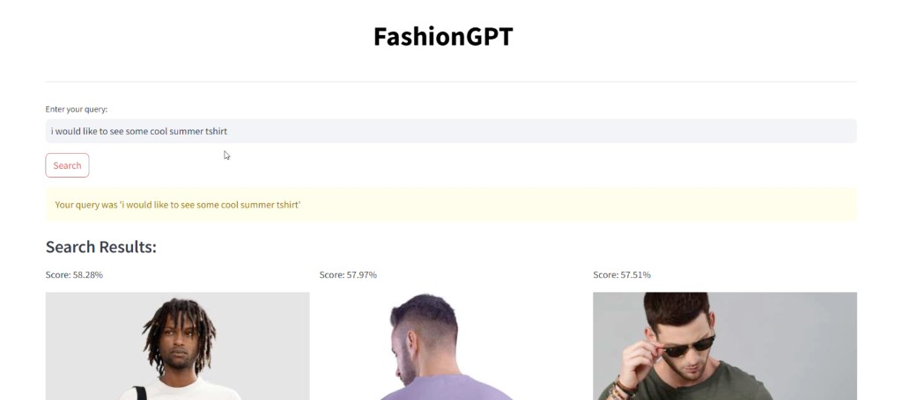
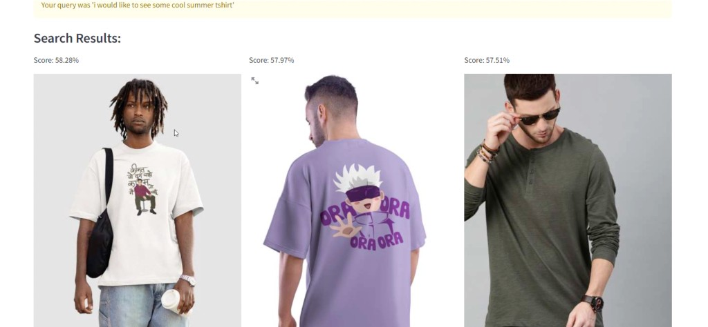

# FASHIONFLAIR

An AI-powered fashion assistant that combines product intelligence, sentiment analytics, and computer-vision try-on experiences in one Streamlit application.

## Overview

FASHIONFLAIR is designed to support fashion discovery and purchase decisions through three core capabilities:
- **Sentiment analysis dashboard** to extract reviews, classify sentiment, visualize patterns, and estimate product quality.
- **Virtual try-on using OpenCV + MediaPipe** to overlay garments on live webcam frames based on body landmarks.
- **Fashion search assistant** that powers query-based recommendations through multimodal retrieval.

## Key Features

- **Review extraction pipeline** from product pages using Selenium automation.
- **Dual sentiment workflows**:
  - GenAI-assisted labeling using Gemini.
  - Traditional ML workflow using text preprocessing + `CountVectorizer` + `RandomForestClassifier`.
- **Visual analytics** for sentiment distributions:
  - class count plots,
  - positive/negative word clouds,
  - training/test classification reports.
- **Virtual try-on module** (`frontend/vton.py`) using:
  - OpenCV for image blending and webcam processing,
  - MediaPipe pose landmarks for shoulder/torso-aware garment placement.
- **Interactive Streamlit UI** with pages for Home, FashionGPT, Try On, and Analysis.

## Repository Structure

- `frontend/home.py` - main Streamlit app and navigation.
- `frontend/vton.py` - virtual try-on pipeline (OpenCV + MediaPipe).
- `frontend/sentimentalanalysis.py` - ML preprocessing, model training, and analytics outputs.
- `frontend/review.py` - review scraping utility.
- `frontend/genai.py` - GenAI-driven sentiment labeling flow.
- `backend/webscrapping.py` - product and image scraping helpers.
- `requirements.txt` - Python dependencies.

## Tech Stack

- **Frontend / App**: Streamlit
- **Computer Vision**: OpenCV, MediaPipe, PIL
- **NLP / ML**: NLTK, scikit-learn, WordCloud
- **Automation / Data Collection**: Selenium
- **GenAI**: Google Gemini API

## Setup

```bash
python -m venv .venv
source .venv/bin/activate
pip install -r requirements.txt
```

Install additional dependencies used in the codebase (if missing from `requirements.txt`):

```bash
pip install pandas numpy seaborn matplotlib scikit-learn nltk wordcloud selenium opencv-python pillow google-generativeai
```

## Run the App

```bash
cd frontend
streamlit run home.py
```

## FashionGPT Outputs

Example query and retrieval results from the FashionGPT page:





## Sentiment Analysis Flow

1. Go to **Analysis -> Extract Reviews** and input a Myntra product ID.
2. Run **Perform Sentiment Analysis** to generate labeled data (`dataset.csv`).
3. Open **Analyze Sentiments** for plots, word clouds, and classification reports.
4. Use **Product Quality** to view positive/negative ratio based product assessment.
5. Use **User Review** to predict sentiment for any custom review text.

## Virtual Try-On Flow (OpenCV)

1. Go to the **Try On** page.
2. Select a garment from the displayed catalog.
3. Start webcam feed and view real-time overlay.
4. Garment sizing is auto-adjusted from pose-estimated shoulder width and torso height.

## Environment Notes

- Set `GOOGLE_API_KEY` before running GenAI sentiment labeling:

```bash
export GOOGLE_API_KEY="your_api_key_here"
```

- `review.py` and backend scrapers expect a valid ChromeDriver setup.
- Some scraper paths in source files are currently Windows-specific and may need local path updates.

## Current Limitations and Next Improvements

- Add a project-level `.gitignore` to exclude `node_modules/` from version control.
- Centralize scraper/browser config via environment variables.
- Add API-style backend interfaces for easier deployment.
- Add tests for sentiment preprocessing and try-on geometry logic.
